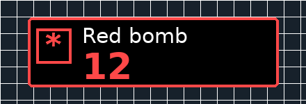

# SusAlert Updated

SusAlert Updated is a standalone Alt1 Toolkit app for the Croesus encounter in RuneScape 3. It provides encounter alerts, a movable next-special countdown, party route guidance, material tracking, rotten fungus tracking, and local run recovery.

The app is read-only. It displays information and does not perform actions in RuneScape.

## Install

Alt1 Toolkit must already be installed.

Open this address in a browser:

```text
alt1://addapp/https://trulyboredadventure.github.io/Sus-Alert-Updated/appconfig.json
```

Approve the app in Alt1. When updating from an older version, remove the old SusAlert Updated entry and install it again.

## Requirements

- RuneScape interface scaling set to 100 percent.
- The boss timer visible and unobstructed.
- Game messages enabled.
- Chat text size of at least 12.
- Local chat timestamps recommended.
- Interface transparency set to 0 percent when using statue indicators.

## Main features

### Encounter alerts

- Automatic Croesus encounter start and end detection.
- Upcoming and incoming special alerts.
- Optional countdown sounds.
- Manual timer correction.
- Middle fungus timer resynchronisation.
- Statue restoration indicators.
- Crystal Mask status and expiry alerts.

### Next-special game overlay

The game overlay shows only the information needed during the encounter:

- A compact special icon.
- The next special name.
- A live countdown.
- Urgency colours as the countdown approaches zero.

The overlay supports small, medium, and large sizes. Its position and size are saved on the current device.



### Party route tracker

- Party sizes of 2, 4, or 8 players.
- Team-size-based roles.
- Separate short-runner and long-runner roles for eight-player teams.
- Material and rotten fungus counters.
- Remaining gather and delivery totals.
- Current plot and next destination.
- Instructions for gathering, clearing, depositing, withdrawing, moving, poisoning, restoring, and praying.
- Rotten fungus responsibility selection.
- Previous-step undo.
- Collapsible tracker panel.
- Automatic reset with the encounter.
- Recovery of a recently interrupted active encounter.

## Set up the next-special overlay

1. Open SusAlert Updated in Alt1.
2. Open Settings from the main app window.
3. Find the Game overlay section.
4. Set Next special to Enabled.
5. Select Small, Medium, or Large.

The Display preview shows how the overlay will look before it is placed in RuneScape.

### Place it with the pointer

1. Select Move.
2. Move the pointer to the preferred position inside the RuneScape window.
3. Return to Settings.
4. Select Set.

Select Cancel to keep the previous position.

### Set an exact location

Enter the X and Y position under Location in game, then select Save.

- X controls the distance from the left edge of the RuneScape window.
- Y controls the distance from the top edge of the RuneScape window.

Select Show in game to display a six-second sample. Select Reset to restore the default position.

The saved position follows the RuneScape window when it moves.

## Use the route tracker

1. Select the party size.
2. Select your role.
3. Select the rotten fungus responsibility when applicable.
4. Enter the Croesus encounter normally.
5. Complete each action in RuneScape.
6. Confirm the completed action in the tracker.
7. Use the plus and minus controls to correct a counter when needed.
8. Use Previous step to undo the most recent route action.

The tracker does not read the inventory. Automatic counter changes are based on the actions confirmed by the player.

## Settings

Settings are saved locally on the current device. Available options include:

- Selected chat box.
- Cursor tooltip details.
- Countdown text style.
- Countdown sound.
- Compact mode.
- Statue indicators.
- Crystal Mask indicators, borders, and sounds.
- Next-special overlay visibility, size, preview, and position.
- Encounter timing adjustments.

## Troubleshooting

### The app cannot find the boss timer

- Confirm the RuneScape interface scale is 100 percent.
- Keep the boss timer visible and unobstructed.
- Reopen the app after changing the interface layout.

### The app cannot find chat

- Enable game messages.
- Increase chat text size to at least 12.
- Open Settings and select the correct detected chat box.
- Enable local chat timestamps when possible.

### The game overlay is not visible

- Confirm Next special is Enabled.
- Select Show in game from Settings.
- Select Reset if the saved position may be outside the visible game area.
- Confirm Alt1 granted the overlay permission.
- Remove and reinstall the app after a major update.

### The overlay is in the wrong place

Use Move and Set for pointer placement, or enter new X and Y values and select Save.

### Counters do not match the inventory

Use the plus and minus controls. The tracker follows confirmed route actions and does not inspect inventory contents.

## Privacy and read-only operation

SusAlert Updated stores settings and active route progress locally. Project code does not send route or encounter state to an external server.

The app does not:

- Click or move the RuneScape client mouse.
- Send keyboard input to RuneScape.
- Select objects, patches, statues, targets, menus, or abilities.
- Read or modify RuneScape process memory.
- Alter game packets.
- Perform gameplay actions for the player.

During overlay placement, the app only reads the current in-game pointer position so it can display the selected location.

The Alt1 permissions are:

```text
pixel,gamestate,overlay
```

## Credits

Original SusAlert was created by Raphire and released under the MIT License.

The original project credits ZeroGwafa for chat detection work and Skillbert for creating Alt1 and assisting with boss timer detection.

SusAlert Updated retains the original credit and license. Additional attribution is available in `NOTICE.md` and `THIRD_PARTY_NOTICES.md`.

## License

SusAlert Updated is distributed under the MIT License. See `LICENSE` for the complete license text.
